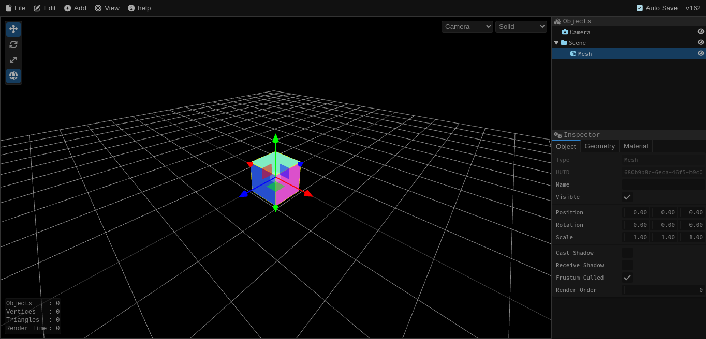
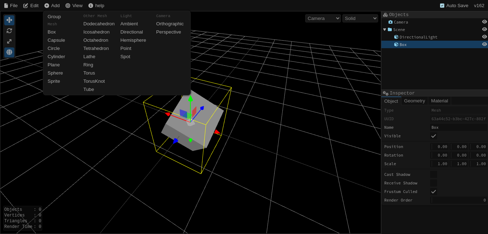

# Editor3

**Editor3** is a modern and extendable [three.js](https://threejs.org/) editor built using [Svelte](https://svelte.dev/). It is currently in a highly active development state, with plans to introduce a wide range of features to enhance 3D scene editing capabilities.

## Screenshots

## Features

- Intuitive user interface built with Svelte.
- Real-time 3D rendering using three.js.
- Basic object manipulation (translate, rotate, scale).
- Real-time scene updates.

